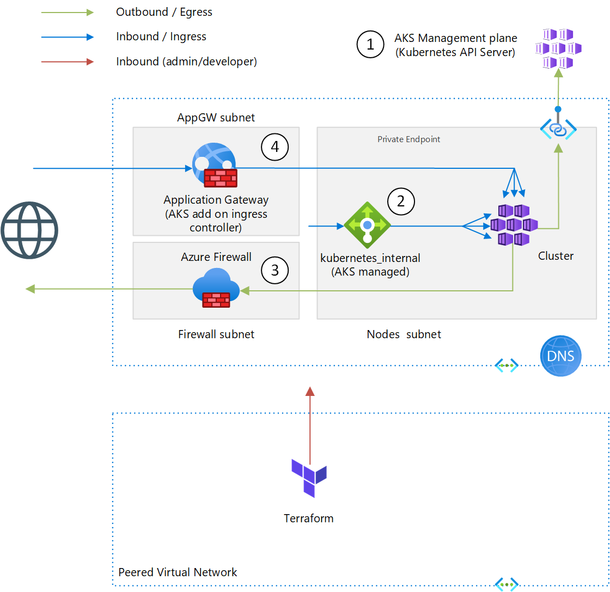
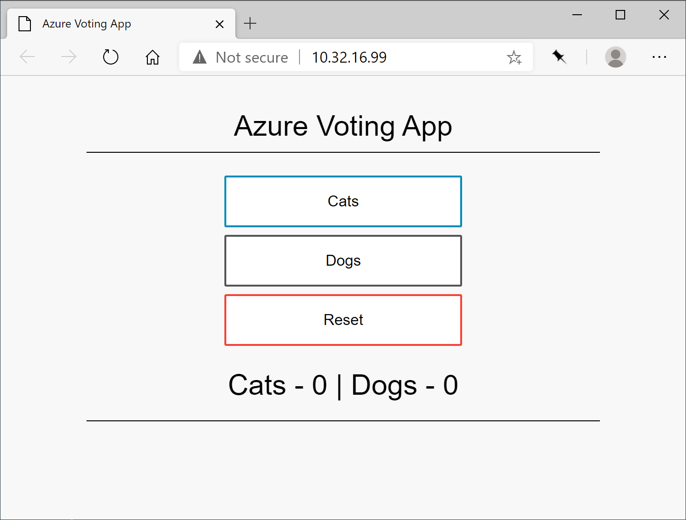
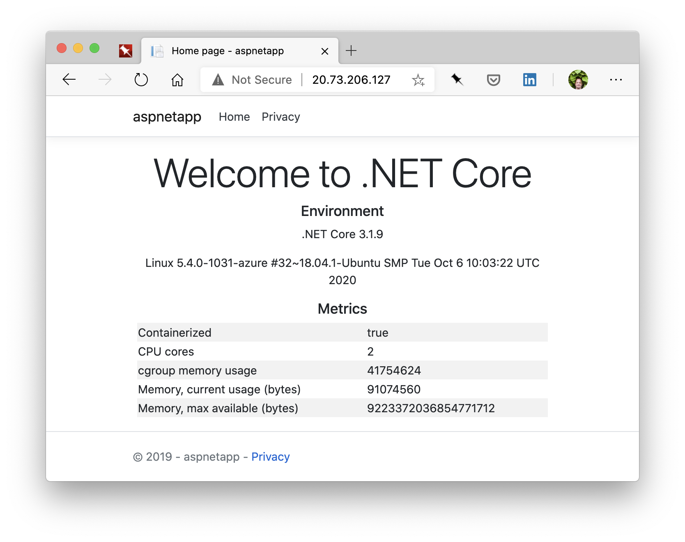

# Network Isolated AKS
 
## Description


When you create an Azure Kubernetes Service (AKS) in the Azure Portal, or the azure CLI, by default it will be open in the sense of traffic (both application & management) using public IP addresses. This is a challenge in Enterprise, especially in regulated industries. Effort is needed to embed services in Virtual Networks, and in the case of AKS there are more moving parts than other Azure services.

To constrain connectivity to/from an AKS cluster, the following available meassures are implemented:

1. The Kubernetes API server is the entry point for Kubernetes management operations, and is hosted as a multi-tenant PaaS service by Microsoft. These kind of services can be projected in the Virtual Network using Private Link ([article](https://docs.microsoft.com/en-us/azure/aks/private-clusters))
1. Instead of an external Load Balancer (with a public IP address), use an internal load balancer ([article](https://docs.microsoft.com/en-us/azure/aks/internal-lb))
1. Use user defined routes and an Azure Firewall to manage egress, instead of breaking out to the Internet directly ([article](https://docs.microsoft.com/en-us/azure/aks/limit-egress-traffic#restrict-egress-traffic-using-azure-firewall))
1. Application Gateway can be used to manage ingress traffic. There are multiple ways to set this up, by far the simples is to use the AKS add on. This let's AKS create the Application Gateway and maintain it's configuration ([article](https://docs.microsoft.com/en-us/azure/application-gateway/tutorial-ingress-controller-add-on-existing))   

Note 2. and 4. are overlapping, you typically use only one of both.

### AKS Networking modes
AKS supports 2 networking 'modes'. These modes control the IP address allocation of the agent nodes in the cluster. In short: 
- [kubenet](https://docs.microsoft.com/en-us/azure/aks/configure-kubenet) creates IP addresses in different address space, and uses NAT to expose the agents. This is where the term 'external IP' comes from, this is a private IP address known to the rest of the network. 
- [Azure CNI](https://docs.microsoft.com/en-us/azure/aks/configure-azure-cni) uses the same address space for agents as the rest of the virtual network.
See [comparison](https://docs.microsoft.com/en-us/azure/aks/concepts-network#compare-network-models)

I won't go into detail of these modes, as the network mode is __irrelevant__ for the isolation meassures you need to take. Choosing one over the other does not make a major difference. This deployment has been tested with Azure CNI.

## Pre-requisites
### Tools
- To get started you need [Git](https://git-scm.com/), [Terraform](https://www.terraform.io/downloads.html) (to get that I use [tfenv](https://github.com/tfutils/tfenv) on Linux & macOS, [Homebrew](https://github.com/hashicorp/homebrew-tap) on macOS or [chocolatey](https://chocolatey.org/packages/terraform) on Windows)
- The AKS add on is configured through [PowerShell](https://github.com/PowerShell/PowerShell#get-powershell), as there is no native Terraform support yet.
- Application deployment requires [kubectl](https://kubernetes.io/docs/tasks/tools/install-kubectl/)

If you're on macOS, you can run '`brew bundle`' in the repo root to get the required tools, as there is a `Brewfile`. 

### Access
Terraform will create a service principal, hence you will need the ability to create one in your AAD tenant. If you do not have that permission, you can use a pre-provisioned service principal instead and configure it using the following variables:
```
aks_sp_application_id
aks_sp_application_secret
aks_sp_object_id
```

### Connectivity
As this deploys an isolated AKS, how will you be able to access the AKS cluster once deployed? If you set the  `peer_network_id` variable to a network where you're running Terraform from (or you are connected to e.g. using VPN), this project will set up the peering and Private DNS link required to look up the Kubernetes API Server and access cluster nodes. Without this you can only perform partial deployment, you won't be able to deploy applications. Set `configure_kubernetes` to `false` in this (disconnected) scenario.

## Provisioning
1. Clone repository:  
`git clone https://github.com/geekzter/azure-aks.git`  

1. Change to the [`terraform`](./terraform) directrory  
`cd azure-aks/terraform`

1. Login to Azure with Azure CLI:  
`az login`   

1. This also authenticates the Terraform [azuread](https://registry.terraform.io/providers/hashicorp/azuread/latest/docs/guides/azure_cli) and [azurerm](https://registry.terraform.io/providers/hashicorp/azurerm/latest/docs/guides/azure_cli) providers. Optionally, you can select the subscription to target:  
`az account set --subscription 00000000-0000-0000-0000-000000000000`   
`ARM_SUBSCRIPTION_ID=$(az account show --query id -o tsv)` (bash, zsh)   
`$env:ARM_SUBSCRIPTION_ID=$(az account show --query id -o tsv)` (pwsh)   

1. You can then provision resources by first initializing Terraform:   
`terraform init`  

1. And then running:  
`terraform apply`

1. Demo applications are deployed with the following script:  
`scripts/deploy_app.ps1`
This script will output the url's used by the demo applications. One application is exposed via Application Gateway and is publically accessible, the other over the internal Load Balancer.

Once deployed the applications will look like this:

Voting App (ILB)  |ASP.NET App (AppGW)
:----------------:|:-----------------:
|


### Clean Up
When you want to destroy resources, run:   
`terraform destroy`
